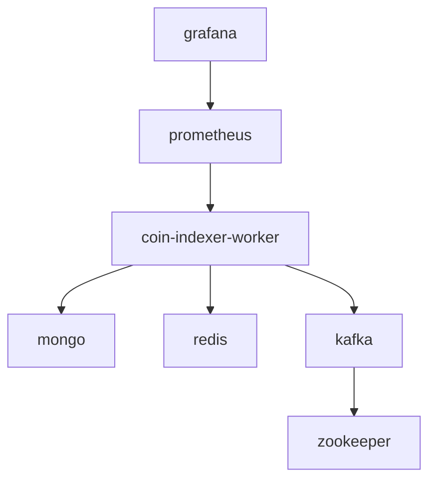

# Docker Deployment Guide

## Quick Start

### 1. Development Mode (Local)
```bash
# Build and start all services
docker-compose up -d

# Check logs
docker-compose logs -f coin-indexer-worker

# Health check
docker exec moonx-coin-indexer-worker python main.py health
```

### 2. Production Mode
```bash
# Build with production settings
./build.sh --prod --deploy

# Or manually with production overrides
docker-compose -f docker-compose.yml -f docker-compose.prod.yml up -d

# With Kafka enabled
COMPOSE_PROFILES=kafka docker-compose -f docker-compose.yml -f docker-compose.prod.yml up -d
```

## Build Options

### Using build.sh Script
```bash
# Development build
./build.sh --dev

# Production build with push to registry
./build.sh --prod --push

# Test build with deployment
./build.sh --test --deploy

# Full production build, push, and deploy
./build.sh --prod --push --deploy
```

### Manual Docker Build
```bash
# Simple build
docker build -t moonx/coin-indexer-worker .

# With build args
docker build \
    --build-arg BUILD_DATE=$(date -u +'%Y-%m-%dT%H:%M:%SZ') \
    --build-arg VERSION=1.0.0 \
    --build-arg ENVIRONMENT=prod \
    -t moonx/coin-indexer-worker:latest .
```

## Configuration

### Environment Variables

#### Required
```env
# MongoDB
MOONX_COIN_MONGODB_URL=mongodb://localhost:27017/moonx_indexer
MOONX_COIN_MONGODB_DATABASE=moonx_indexer

# Redis
MOONX_COIN_REDIS_URL=redis://localhost:6379
MOONX_COIN_REDIS_DB=0
```

#### Optional
```env
# Kafka (for event streaming)
MOONX_COIN_KAFKA_BOOTSTRAP_SERVERS=kafka:9092
MOONX_COIN_KAFKA_ENABLED=true

# Performance Tuning
MOONX_COIN_MAX_CONCURRENT_CONTRACTS=4
MOONX_COIN_MAX_CONCURRENT_BLOCKS=3
MOONX_COIN_DATABASE_BATCH_SIZE=100

# Logging
MOONX_COIN_LOG_LEVEL=INFO
MOONX_COIN_LOG_FORMAT=json
```

### Volume Mounts

```yaml
volumes:
  - ./logs:/app/logs              # Application logs
  - ./data:/app/data              # Persistent data
  - ./config:/app/config:ro       # Configuration files (read-only)
```

### Config Files Structure
```
config/
├── chains/
│   ├── base.json               # Base network config
│   └── ethereum.json           # Ethereum config (if needed)
└── custom-settings.json        # Override settings
```

## Service Architecture

### Services Overview
```
┌─────────────────────────────────┐
│     Coin Indexer Worker         │
│  ┌─────────────────────────┐    │
│  │     Event Indexer       │    │
│  │  ┌─────────────────┐    │    │
│  │  │  RPC Failover   │────┼────┼──► Blockchain RPCs
│  │  └─────────────────┘    │    │
│  │  ┌─────────────────┐    │    │
│  │  │  Event Parsers  │    │    │
│  │  └─────────────────┘    │    │
│  └─────────────────────────┘    │
│  ┌─────────────────────────┐    │
│  │     Data Storage        │    │
│  │  ┌─────────────────┐    │    │
│  │  │    MongoDB      │────┼────┼──► Persistent Storage
│  │  └─────────────────┘    │    │
│  │  ┌─────────────────┐    │    │
│  │  │     Redis       │────┼────┼──► Cache Layer
│  │  └─────────────────┘    │    │
│  └─────────────────────────┘    │
│  ┌─────────────────────────┐    │
│  │    Event Streaming      │    │
│  │  ┌─────────────────┐    │    │
│  │  │     Kafka       │────┼────┼──► Message Queue
│  │  └─────────────────┘    │    │
│  └─────────────────────────┘    │
└─────────────────────────────────┘
```

### Container Dependencies


## Health Monitoring

### Built-in Health Check
```bash
# Docker health check (automatic)
docker inspect moonx-coin-indexer-worker | grep Health -A 10

# Manual health check
docker exec moonx-coin-indexer-worker python main.py health

# RPC status
docker exec moonx-coin-indexer-worker python main.py rpc-stats

# Configuration check
docker exec moonx-coin-indexer-worker python main.py config
```

### Service Monitoring
```bash
# Container stats
docker stats moonx-coin-indexer-worker

# Logs (real-time)
docker-compose logs -f coin-indexer-worker

# Logs (specific lines)
docker-compose logs --tail=100 coin-indexer-worker
```

## Production Deployment

### Prerequisites
```bash
# Required external services
- MongoDB cluster (replica set recommended)
- Redis cluster (with persistence)
- Kafka cluster (for high-throughput)
- Load balancer (for multiple instances)
```

### Production Checklist

#### ✅ Infrastructure
- [ ] MongoDB replica set configured
- [ ] Redis with AOF/RDB persistence
- [ ] Kafka cluster with replication
- [ ] Network security groups configured
- [ ] SSL/TLS certificates in place

#### ✅ Configuration
- [ ] Environment variables set
- [ ] Resource limits configured
- [ ] Log retention policies set
- [ ] Backup strategies in place
- [ ] Monitoring alerts configured

#### ✅ Security  
- [ ] Non-root user (app:app)
- [ ] Read-only config mounts
- [ ] Network isolation
- [ ] Secrets management
- [ ] Regular security updates

### Scaling Options

#### Horizontal Scaling
```bash
# Multiple instances with different chain IDs
docker-compose -f docker-compose.yml -f docker-compose.prod.yml up -d --scale coin-indexer-worker=3

# Or use specific chain configurations
docker run -d \
  -e MOONX_COIN_DEFAULT_CHAIN_ID=1 \
  --name moonx-indexer-ethereum \
  moonx/coin-indexer-worker

docker run -d \
  -e MOONX_COIN_DEFAULT_CHAIN_ID=8453 \
  --name moonx-indexer-base \
  moonx/coin-indexer-worker
```

#### Resource Scaling
```yaml
# In docker-compose.prod.yml
deploy:
  resources:
    limits:
      memory: 2G        # Increase for high throughput
      cpus: '2.0'       # More CPU for parallel processing
```

### Performance Tuning

#### High-Throughput Settings
```env
# Process more contracts in parallel
MOONX_COIN_MAX_CONCURRENT_CONTRACTS=8

# Increase batch sizes
MOONX_COIN_DATABASE_BATCH_SIZE=500
MOONX_COIN_EVENT_PROCESSING_BATCH_SIZE=200

# Reduce worker interval for real-time processing
MOONX_COIN_WORKER_INTERVAL_SECONDS=5

# Increase block range per request
MOONX_COIN_MAX_BLOCKS_PER_REQUEST=5000
```

#### Memory Optimization
```env
# Python memory optimization
PYTHONUNBUFFERED=1
PYTHONDONTWRITEBYTECODE=1

# Redis memory limits
REDIS_MAXMEMORY=512mb
REDIS_MAXMEMORY_POLICY=allkeys-lru
```

## Troubleshooting

### Common Issues

#### 1. Container Won't Start
```bash
# Check logs
docker-compose logs coin-indexer-worker

# Check dependencies
docker-compose ps

# Validate configuration
docker run --rm moonx/coin-indexer-worker python main.py config
```

#### 2. Database Connection Issues
```bash
# Test MongoDB connection
docker exec moonx-mongo mongosh --eval "db.runCommand('ping')"

# Test Redis connection  
docker exec moonx-redis redis-cli ping

# Check network connectivity
docker network ls
docker network inspect moonx-network
```

#### 3. RPC Connection Problems
```bash
# Check RPC stats
docker exec moonx-coin-indexer-worker python main.py rpc-stats

# Test individual RPC
curl -X POST https://mainnet.base.org \
  -H "Content-Type: application/json" \
  -d '{"jsonrpc":"2.0","method":"eth_blockNumber","params":[],"id":1}'
```

#### 4. Performance Issues
```bash
# Monitor resource usage
docker stats

# Check service health
docker exec moonx-coin-indexer-worker python main.py health

# Analyze logs for bottlenecks
docker-compose logs coin-indexer-worker | grep -E "(ERROR|slow|timeout)"
```

### Recovery Procedures

#### Reset and Restart
```bash
# Reset progress (WARNING: Will re-index from start_block)
docker exec moonx-coin-indexer-worker python main.py start --reset-progress

# Restart specific service
docker-compose restart coin-indexer-worker

# Full system restart
docker-compose down && docker-compose up -d
```

#### Database Recovery
```bash
# MongoDB backup
docker exec moonx-mongo mongodump --db moonx_indexer --out /backup

# Redis backup
docker exec moonx-redis redis-cli BGSAVE
```

## Maintenance

### Updates
```bash
# Pull latest images
docker-compose pull

# Rebuild with latest code
./build.sh --prod --push --deploy

# Rolling update (zero-downtime)
docker service update --image moonx/coin-indexer-worker:latest moonx_coin-indexer-worker
```

### Cleanup
```bash
# Remove old images
docker image prune -f

# Clean up volumes (WARNING: Data loss)
docker-compose down -v

# Clean logs
docker exec moonx-coin-indexer-worker sh -c 'find /app/logs -name "*.log" -mtime +7 -delete'
```

## Support

### Debug Information
```bash
# Generate debug report
docker exec moonx-coin-indexer-worker python main.py config > config.json
docker exec moonx-coin-indexer-worker python main.py health > health.json
docker exec moonx-coin-indexer-worker python main.py rpc-stats > rpc-stats.json

# System information
docker version
docker-compose version
docker system info
```

### Logs Collection
```bash
# Export all logs
docker-compose logs > moonx-indexer-logs.txt

# Export specific timeframe
docker-compose logs --since="2024-01-01T00:00:00" coin-indexer-worker
```
