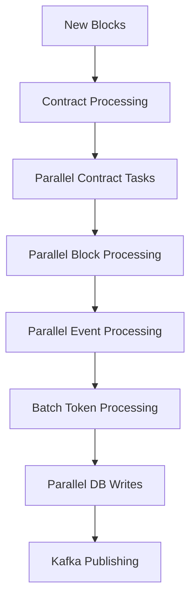

# MoonX Coin Indexer Worker

A specialized indexer for tracking new coin creation events on blockchain networks, specifically designed to monitor CreatorCoin and Clanker token creation events.

## Features

- **Event Monitoring**: Tracks CreatorCoinCreated and TokenCreated events
- **Multi-Chain Support**: Configurable for different blockchain networks  
- **Real-time Processing**: Processes events as new blocks are produced
- **Data Storage**: Saves token information to MongoDB
- **Event Publishing**: Publishes events to Kafka for downstream processing
- **Caching**: Redis caching for performance optimization
- **Health Monitoring**: Built-in health checks and monitoring
- **Docker Support**: Full containerization with docker-compose
- **Production Ready**: Graceful shutdown, resource management, scaling

## Supported Events

### CreatorCoinCreated
- **Contract**: `0x777777751622c0d3258f214f9df38e35bf45baf3`
- **Event**: CreatorCoinCreated with pool key information
- **Data**: Token metadata, creator info, pool configuration

### TokenCreated (Clanker)
- **Contract**: `0xe85a59c628f7d27878aceb4bf3b35733630083a9`
- **Event**: TokenCreated from Clanker v4.0.0
- **Data**: Token metadata, admin info, pool configuration

## Architecture

```
┌─────────────────┐    ┌───────────────┐    ┌─────────────────┐
│   Blockchain    │    │     Redis     │    │    MongoDB      │
│     (Base)      │────│     Cache     │────│   (Tokens)      │
└─────────────────┘    └───────────────┘    └─────────────────┘
         │                       │                       │
         │              ┌─────────────────┐               │
         └──────────────│  Coin Indexer   │───────────────┘
                        │     Worker      │
                        └─────────────────┘
                                 │
                        ┌─────────────────┐
                        │      Kafka      │
                        │   (Events)      │
                        └─────────────────┘
```

## Configuration

### Environment Variables

| Variable | Description | Default |
|----------|-------------|---------|
| `MOONX_COIN_MONGODB_URL` | MongoDB connection string | `mongodb://localhost:27017` |
| `MOONX_COIN_MONGODB_DATABASE` | MongoDB database name | `moonx_coin_indexer` |
| `MOONX_COIN_REDIS_URL` | Redis connection string | `redis://localhost:6379` |
| `MOONX_COIN_KAFKA_BOOTSTRAP_SERVERS` | Kafka bootstrap servers | None (optional) |
| `MOONX_COIN_LOG_LEVEL` | Logging level | `INFO` |
| `MOONX_COIN_LOG_FORMAT` | Log format (json/console) | `json` |

### Chain Configuration

Chain configurations are stored in `config/chains/*.json` with clean RPC architecture:

```json
{
  "chain_id": 8453,
  "name": "Base",
  "rpc_urls": [
    "https://mainnet.base.org",
    "https://base.gateway.tenderly.co", 
    "https://base.llamarpc.com"
  ],
  "backup_rpc_urls": [
    "https://base-rpc.publicnode.com",
    "https://1rpc.io/base"
  ],
  "start_block": 21000000,
  "contracts": {
    "creator_coin_factory": "0x777777751622c0d3258f214f9df38e35bf45baf3",
    "clanker_factory": "0xe85a59c628f7d27878aceb4bf3b35733630083a9"
  },
  "monitoring": {
    "max_rpc_failures": 5,
    "rpc_switch_threshold": 3
  },
  "performance": {
    "request_timeout": 30,
    "concurrent_requests": 5,
    "batch_size": 50
  }
}
```

**Key Improvements:**
- ✅ **Single RPC mechanism**: Only `rpc_urls` (removed redundant `rpc_url`)  
- ✅ **Clean architecture**: No unused configuration bloat
- ✅ **Validation**: Ensures at least one valid RPC URL exists
- ✅ **Minimal config**: Removed unused `gas_price_strategy`, `features`, `indexing` sections

## Installation

### 🐳 Docker Installation (Recommended)

**Quick Start with Docker:**
```bash
# Clone repository
cd workers/coin-indexer-worker

# Start all services (MongoDB, Redis, Worker)
docker-compose up -d

# Check status
docker-compose ps

# View logs
docker-compose logs -f coin-indexer-worker
```

**Production Deployment:**
```bash
# Build and deploy production setup
./build.sh --prod --deploy

# Or manually with production overrides
docker-compose -f docker-compose.yml -f docker-compose.prod.yml up -d
```

📖 **See [Docker Deployment Guide](DOCKER_DEPLOYMENT.md) for detailed instructions**

### 🐍 Manual Python Installation

**Automated Installation:**
```bash
# Clone repository
cd workers/coin-indexer-worker

# Run automated installation script
./install.sh

# Edit configuration
nano .env

# Run the worker
python main.py start
```

### Manual Installation

```bash
# Clone repository  
cd workers/coin-indexer-worker

# Create virtual environment
python -m venv venv
source venv/bin/activate  # On Windows: venv\\Scripts\\activate

# Install dependencies (try in order if one fails)
pip install -r requirements.txt

# If you get version conflicts, try these alternatives:
# pip install -r requirements-stable.txt    # Known stable versions
# pip install -r requirements-minimal.txt   # Latest versions without constraints

# Upgrade pip if needed
pip install --upgrade pip

# Copy environment example
cp environment.example .env

# Edit configuration
nano .env

# Run the worker
python main.py start
```

### Docker

```bash
# Build image
docker build -t moonx-coin-indexer .

# Run container
docker run -d \
  --name coin-indexer \
  -e MOONX_COIN_MONGODB_URL=mongodb://mongo:27017 \
  -e MOONX_COIN_REDIS_URL=redis://redis:6379 \
  moonx-coin-indexer
```

## Usage

### 🐳 Docker Commands

```bash
# Start services
docker-compose up -d

# Check health
docker exec moonx-coin-indexer-worker python main.py health

# View configuration
docker exec moonx-coin-indexer-worker python main.py config

# Check RPC status
docker exec moonx-coin-indexer-worker python main.py rpc-stats

# View logs
docker-compose logs -f coin-indexer-worker

# Stop services
docker-compose down
```

### 🐍 Python CLI Commands

```bash
# Start the indexer
python main.py start

# Start with specific chain
python main.py start --chain-id 8453

# Start with debug logging  
python main.py start --debug

# Reset progress and start fresh
python main.py start --reset-progress

# Check configuration
python main.py config

# Check RPC endpoint statistics  
python main.py rpc-stats

# Check RPC stats for specific chain
python main.py rpc-stats --chain-id 8453
```

### Health Check

The worker provides health check endpoints:

```bash
curl http://localhost:8080/health
```

## Data Models

### TokenInfo

Main model for storing token information:

```python
{
  "token_address": "0x...",
  "chain_id": 8453,
  "source": "creator_coin" | "clanker", 
  "name": "Token Name",
  "symbol": "SYMBOL",
  "creator": "0x...",
  "creation_block": 12345678,
  "creation_timestamp": "2024-01-01T00:00:00Z",
  "metadata_uri": "ipfs://...",
  "status": "active"
}
```

## RPC Failover System

The worker implements intelligent RPC endpoint management:

### Features
- **Round-Robin**: Distributes load across multiple primary RPCs
- **Automatic Failover**: Switches to backup RPCs when primaries fail
- **Health Tracking**: Monitors success/failure rates for each endpoint
- **Cooldown Periods**: Prevents rapid switching between failing endpoints
- **Statistics**: Tracks request counts, failure rates, and response times

### Failover Logic
1. **Primary RPCs**: Used first in round-robin fashion
2. **Failure Detection**: Marks RPC unhealthy after 3 consecutive failures
3. **Backup Activation**: Switches to backup RPCs when all primaries fail
4. **Recovery**: Periodically retries failed endpoints after cooldown
5. **Logging**: Detailed logs for RPC switching and health status

```bash
# Monitor RPC health in real-time
python main.py rpc-stats

# Output shows:
# Current RPC: https://mainnet.base.org
# Primary RPCs (3): 
#   1. https://mainnet.base.org - 🟢 Healthy (99.5% success)
#   2. https://base.gateway.tenderly.co - 🔴 Unhealthy (85% success) 
#   3. https://base.llamarpc.com - 🟢 Healthy (98% success)
```

## Multithreading Performance Architecture

The worker is designed for maximum throughput with intelligent parallel processing:

### **Multi-Level Parallelism**
1. **Contract Level**: Process multiple contracts simultaneously
2. **Block Level**: Process blocks in parallel batches  
3. **Event Level**: Process token events concurrently
4. **Database Level**: Batch operations for optimal I/O

### **Performance Configuration**
```bash
# Parallel processing limits (optimized for single-chain processing)
MOONX_COIN_MAX_CONCURRENT_CONTRACTS=4     # Contracts processed in parallel
MOONX_COIN_MAX_CONCURRENT_BLOCKS=3        # Block ranges processed in parallel
MOONX_COIN_EVENT_PROCESSING_BATCH_SIZE=50 # Events per batch

# High-throughput production settings
MOONX_COIN_WORKER_POOL_SIZE=8
MOONX_COIN_MAX_CONCURRENT_CONTRACTS=6  
MOONX_COIN_EVENT_PROCESSING_BATCH_SIZE=100
```

### **Async Processing Flow**


### **Performance Benefits**
- **3-5x Faster**: Compared to sequential processing
- **Optimal Resource Usage**: CPU and I/O efficiency
- **Resilient**: Error in one parallel task doesn't affect others
- **Scalable**: Easy to tune based on hardware capacity

## Event Flow

1. **Block Monitoring**: Worker monitors new blocks on configured chains
2. **Parallel Log Retrieval**: Fetches logs from multiple contracts simultaneously (with RPC failover)
3. **Concurrent Event Parsing**: Parses raw logs into structured event data in parallel
4. **Batch Token Processing**: Creates TokenInfo records in optimized batches
5. **Parallel Database Storage**: Saves tokens to MongoDB with concurrent writes
6. **Async Event Publishing**: Publishes events to Kafka without blocking main flow
7. **Progress Tracking**: Updates last processed block number

## Kafka Events

### Token Created Event

```json
{
  "event_type": "token_created",
  "chain_id": 8453,
  "timestamp": "2024-01-01T00:00:00Z",
  "token": {
    "token_address": "0x...",
    "name": "Token Name",
    "symbol": "SYMBOL",
    "creator": "0x...",
    "source": "creator_coin"
  }
}
```

### Audit Request Event

```json
{
  "event_type": "token_audit_request",
  "chain_id": 8453,
  "token_address": "0x...",
  "timestamp": "2024-01-01T00:00:00Z",
  "token_data": { ... },
  "priority": "normal"
}
```

## Monitoring

- **Logs**: Structured JSON logging with configurable levels
- **Health Checks**: Service component health monitoring
- **Metrics**: Redis-based statistics tracking
- **Progress**: Block processing progress tracking

## Development

### Adding New Event Types

1. Create parser in `services/parsers/`
2. Add event model in `models/token.py`
3. Update `TokenInfo.from_*_event()` methods
4. Register parser in `TokenIndexerService`
5. Add contract configuration

### Testing

```bash
# Run tests
pytest

# Test specific parser
python -m pytest tests/test_parsers.py

# Test with coverage
python -m pytest --cov=services tests/
```

## Troubleshooting

### Installation Issues

1. **aiokafka Version Error**: 
   ```bash
   # Try stable versions
   pip install -r requirements-stable.txt
   
   # Or minimal versions
   pip install -r requirements-minimal.txt
   
   # Or install without aiokafka (disables Kafka publishing)
   pip install -r requirements.txt --ignore-installed aiokafka
   ```

2. **Python Version Compatibility**:
   ```bash
   # Ensure Python 3.8+
   python --version
   
   # Upgrade pip
   pip install --upgrade pip
   
   # Clear pip cache if needed
   pip cache purge
   ```

3. **Dependency Conflicts**:
   ```bash
   # Create fresh virtual environment
   rm -rf venv
   python -m venv venv
   source venv/bin/activate
   
   # Install with no-deps to resolve manually
   pip install --no-deps -r requirements.txt
   ```

### Runtime Issues

1. **RPC Connection Failures**: Check RPC URLs and rate limits
2. **MongoDB Connection**: Verify connection string and authentication
3. **Missing Events**: Check start block configuration
4. **Parsing Errors**: Verify contract ABIs and event signatures

### Debug Mode

```bash
# Enable debug logging
python main.py start --debug

# Check RPC status
python main.py rpc-stats --chain-id 8453

# Check configuration
python main.py config
```

## License

MIT License - see LICENSE file for details.
