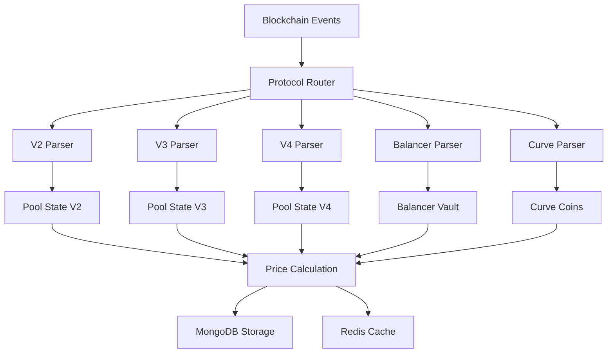

# MoonX Indexer - Protocol Architecture Documentation

## Tổng quan

MoonX Indexer Worker được thiết kế để hỗ trợ đầy đủ các giao thức DEX (Decentralized Exchange) phổ biến nhất. Kiến trúc modular cho phép dễ dàng mở rộng và bảo trì các protocol khác nhau.

## Các Protocol được hỗ trợ

### 1. **Uniswap V2** 
- **Mô hình**: Constant Product AMM (x * y = k)
- **Event**: `PairCreated`, `Swap`
- **Đặc điểm**: 
  - Sử dụng reserves (reserve0, reserve1)
  - Fee cố định 0.3%
  - Price tính từ ratio reserves
- **Chains**: Ethereum, Polygon, Arbitrum, Optimism

### 2. **Uniswap V3**
- **Mô hình**: Concentrated Liquidity AMM
- **Event**: `PoolCreated`, `Swap`
- **Đặc điểm**:
  - Sử dụng sqrt price và tick system
  - Multiple fee tiers (0.01%, 0.05%, 0.3%, 1%)
  - Concentrated liquidity ranges
- **Chains**: Ethereum, Polygon, Arbitrum, Optimism, Base

### 3. **Uniswap V4** ⚡ (Mới nhất)
- **Mô hình**: Singleton Pattern + Hooks
- **Event**: `PoolInitialized`, `Swap`
- **Đặc điểm**:
  - Single PoolManager contract
  - Custom hooks cho mỗi pool
  - Gas optimization extreme
  - Pool IDs thay vì addresses
- **Chains**: Ethereum (testnet), sẽ mở rộng

### 4. **SushiSwap V2**
- **Mô hình**: Fork của Uniswap V2
- **Event**: `PairCreated`, `Swap` 
- **Đặc điểm**:
  - Tương tự Uniswap V2
  - Integrated với SUSHI rewards
- **Chains**: Ethereum, Polygon, Arbitrum, BSC

### 5. **SushiSwap V3**
- **Mô hình**: Fork của Uniswap V3
- **Event**: `PoolCreated`, `Swap`
- **Đặc điểm**:
  - Concentrated liquidity như V3
  - SushiSwap branding và incentives
- **Chains**: Ethereum, Polygon, Arbitrum

### 6. **PancakeSwap V2**
- **Mô hình**: Uniswap V2 trên BSC
- **Event**: `PairCreated`, `Swap`
- **Đặc điểm**:
  - Optimized cho BSC
  - Lower fees
  - CAKE token rewards
- **Chains**: BSC, Ethereum, Polygon

### 7. **PancakeSwap V3**
- **Mô hình**: Uniswap V3 trên multi-chain
- **Event**: `PoolCreated`, `Swap`
- **Đặc điểm**:
  - Concentrated liquidity
  - Multi-chain deployment
- **Chains**: BSC, Ethereum, Arbitrum

### 8. **Balancer V2**
- **Mô hình**: Weighted Pool AMM
- **Event**: `PoolRegistered`, `Swap`
- **Đặc điểm**:
  - Multiple tokens per pool (up to 8)
  - Custom weights (80/20, 60/40, etc.)
  - Vault-based architecture
- **Chains**: Ethereum, Polygon, Arbitrum

### 9. **Curve**
- **Mô hình**: StableSwap AMM
- **Event**: `PlainPoolDeployed`, `TokenExchange`
- **Đặc điểm**:
  - Optimized for stablecoins
  - Low slippage for similar assets
  - Complex mathematical curves
- **Chains**: Ethereum, Polygon, Arbitrum

## Kiến trúc Implementation

### Core Components

```python
class PoolProtocol(str, Enum):
    UNISWAP_V2 = "uniswap_v2"
    UNISWAP_V3 = "uniswap_v3" 
    UNISWAP_V4 = "uniswap_v4"
    SUSHISWAP = "sushiswap"
    SUSHISWAP_V3 = "sushiswap_v3"
    PANCAKESWAP_V2 = "pancakeswap_v2"
    PANCAKESWAP_V3 = "pancakeswap_v3"
    BALANCER_V2 = "balancer_v2"
    CURVE = "curve"
```

### Protocol-Specific Logic

#### 1. **Pool Creation Parsing**

Mỗi protocol có event structure khác nhau:

```python
# Uniswap V2/V3
async def _parse_uniswap_v2_pool_created(log, block_number, block_timestamp)
async def _parse_uniswap_v3_pool_created(log, block_number, block_timestamp)

# SushiSwap 
async def _parse_sushiswap_pool_created(log, block_number, block_timestamp)

# PancakeSwap
async def _parse_pancakeswap_v2_pool_created(log, block_number, block_timestamp)

# Balancer
async def _parse_balancer_v2_pool_created(log, block_number, block_timestamp)

# Curve  
async def _parse_curve_pool_created(log, block_number, block_timestamp)
```

#### 2. **Pool State Management**

Khác nhau theo từng loại AMM:

```python
# V2-style: Reserves
async def get_uniswap_v2_pool_state(pool_address) -> Dict[str, Any]:
    # Returns: reserve0, reserve1, last_update_timestamp

# V3-style: Sqrt Price + Tick
async def get_uniswap_v3_pool_state(pool_address) -> Dict[str, Any]: 
    # Returns: sqrt_price_x96, current_tick, liquidity, tick_spacing

# Balancer: Vault-based
async def get_balancer_pool_tokens(pool_address) -> List[TokenInfo]:

# Curve: Multi-coin
async def get_curve_pool_coins(pool_address) -> List[TokenInfo]:
```

#### 3. **Price Calculations**

```python
# V2-style: From reserves
def _calculate_prices_from_reserves(reserve0, reserve1, decimals0, decimals1):
    # price = reserve1/reserve0 (adjusted for decimals)

# V3-style: From sqrt price 
def _calculate_prices_from_sqrt_price(sqrt_price_x96, decimals0, decimals1):
    # Convert sqrt_price_x96 to actual price
```

#### 4. **Swap Event Parsing**

```python
# V2-style events
def _parse_uniswap_v2_swap(log, pool_info, block_number, block_timestamp):
    # event Swap(address indexed sender, uint256 amount0In, uint256 amount1In, uint256 amount0Out, uint256 amount1Out, address indexed to)

# V3-style events  
def _parse_uniswap_v3_swap(log, pool_info, block_number, block_timestamp):
    # event Swap(address indexed sender, address indexed recipient, int256 amount0, int256 amount1, uint160 sqrtPriceX96, uint128 liquidity, int24 tick)

# V4-style events
def _parse_uniswap_v4_swap(log, pool_info, block_number, block_timestamp):
    # event Swap(PoolId indexed id, address indexed sender, int128 amount0, int128 amount1, uint160 sqrtPriceX96, uint128 liquidity, int24 tick)
```

## Data Flow Architecture



## Cách thêm Protocol mới

### Bước 1: Thêm Protocol Enum

```python
# models/pool.py
class PoolProtocol(str, Enum):
    # ... existing protocols
    NEW_PROTOCOL = "new_protocol"
```

### Bước 2: Chain Configuration

```json
// config/chains/[chain].json
{
  "pools": [
    {
      "protocol": "new_protocol",
      "factory": "0x...",
      "router": "0x...", 
      "pool_created_topic": "0x..."
    }
  ]
}
```

### Bước 3: Implement Parser Methods

```python
# services/blockchain.py

async def _parse_new_protocol_pool_created(self, log, block_number, block_timestamp):
    """Parse new protocol pool creation event."""
    # 1. Extract addresses from topics/data
    # 2. Get token information
    # 3. Get pool state (if applicable)
    # 4. Return PoolInfo object

def _parse_new_protocol_swap(self, log, pool_info, block_number, block_timestamp):
    """Parse new protocol swap event."""
    # 1. Extract swap data from event
    # 2. Map to standard SwapEvent format
    # 3. Return SwapEvent object

async def get_new_protocol_pool_state(self, pool_address):
    """Get protocol-specific pool state."""
    # 1. Make contract calls
    # 2. Parse responses
    # 3. Return structured data
```

### Bước 4: Update Router Logic

```python
# services/blockchain.py

# In parse_pool_created_event
elif protocol == "new_protocol":
    return await self._parse_new_protocol_pool_created(log, block_number, block_timestamp)

# In parse_swap_event  
elif pool_info.protocol == PoolProtocol.NEW_PROTOCOL:
    return self._parse_new_protocol_swap(log, pool_info, block_number, block_timestamp)
```

### Bước 5: Update Database Schema

```javascript
// init-mongo.js
protocol: {
  enum: ['uniswap_v2', 'uniswap_v3', 'uniswap_v4', 'sushiswap', 'sushiswap_v3', 'pancakeswap_v2', 'pancakeswap_v3', 'balancer_v2', 'curve', 'new_protocol'],
  description: 'Protocol must be a supported DEX protocol'
}
```

## Event Topic References

### Pool Creation Events

```javascript
// Uniswap V2/SushiSwap/PancakeSwap V2
"0x0d3648bd0f6ba80134a33ba9275ac585d9d315f0ad8355cddefde31afa28d0e9" // PairCreated

// Uniswap V3/SushiSwap V3/PancakeSwap V3  
"0x783cca1c0412dd0d695e784568c96da2e9c22ff989357a2e8b1d9b2b4e6b7118" // PoolCreated

// Uniswap V4
"0x..." // PoolInitialized (TBD)

// Balancer V2
"0x3c13bc30b8e878c53fd2a36b679409c073afd75950be43d8858768e956fbc20e" // PoolRegistered

// Curve
"0x..." // PlainPoolDeployed (varies by factory)
```

### Swap Events

```javascript
// Uniswap V2/SushiSwap/PancakeSwap V2
"0xd78ad95fa46c994b6551d0da85fc275fe613ce37657fb8d5e3d130840159d822" // Swap

// Uniswap V3/SushiSwap V3/PancakeSwap V3
"0xc42079f94a6350d7e6235f29174924f928cc2ac818eb64fed8004e115fbcca67" // Swap

// Balancer V2
"0x2170c741c41531aec20e7c107c24eecfdd15e69c9bb0a8dd37b1840b9e0b207b" // Swap

// Curve
"0x8b3e96f2b889fa771c53c981b40daf005f63f637f1869f707052d15a3dd97140" // TokenExchange
```

## Performance Considerations

### 1. **Batch Processing**
- Process pools in batches của 100-1000
- Parallel processing cho multiple chains
- Use connection pooling

### 2. **Caching Strategy**
- Redis cache cho token info (TTL: 24h)
- Pool state cache (TTL: 5 min)
- Deduplication cache (TTL: 7 days)

### 3. **Database Optimization**
- Proper indexing cho price queries
- Partitioning theo chain_id
- Archival strategy cho old data

### 4. **Rate Limiting**
- RPC call throttling
- Exponential backoff
- Circuit breaker pattern

## Testing Strategy

### 1. **Unit Tests**
```python
# Test mỗi protocol parser
test_parse_uniswap_v2_pool_created()
test_parse_uniswap_v3_swap()
test_calculate_prices_from_sqrt_price()
```

### 2. **Integration Tests**  
```python
# Test end-to-end flow
test_index_uniswap_v3_pool_lifecycle()
test_price_calculation_accuracy()
```

### 3. **Load Tests**
```python
# Test performance
test_batch_processing_1000_pools()
test_concurrent_chain_indexing()
```

## Monitoring & Alerting

### 1. **Key Metrics**
- Pools indexed per minute
- Price calculation accuracy
- Event processing latency
- Error rates by protocol

### 2. **Health Checks**
- RPC connectivity
- Database health
- Cache availability
- Recent block processing

### 3. **Alerts**
- Protocol parsing failures
- Unusual price movements
- High error rates
- Processing delays

Kiến trúc này đảm bảo tính mở rộng, maintainability và performance cao cho việc indexing đa giao thức DEX.