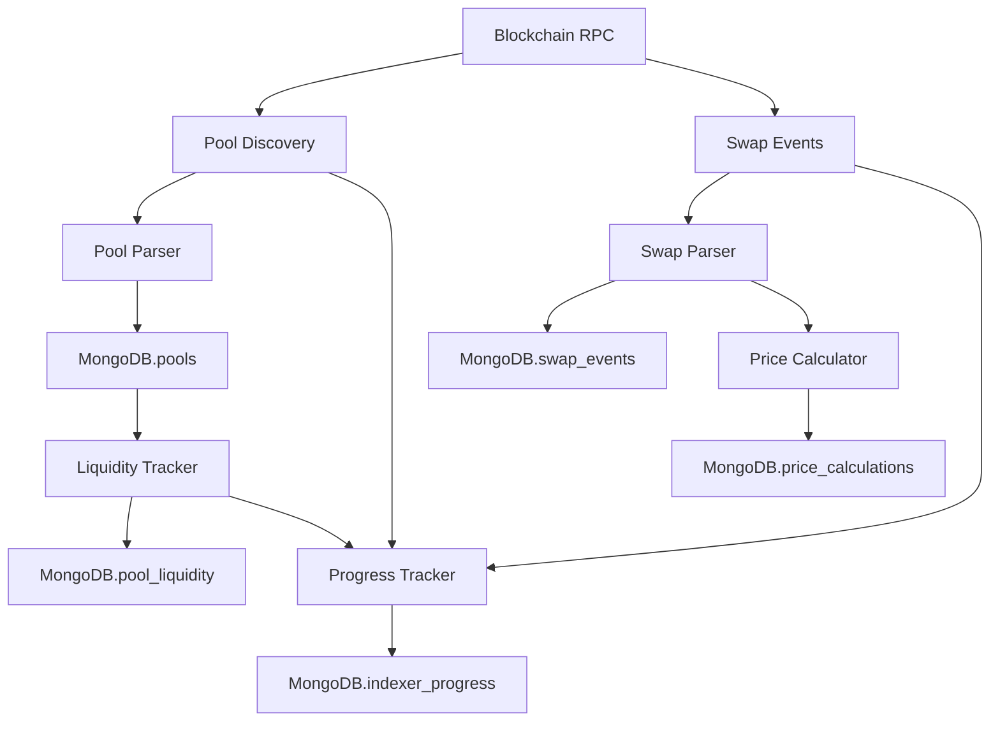

# MoonX Indexer Worker - Documentation

## 📚 Documentation Overview

This directory contains comprehensive documentation for the MoonX Indexer Worker system.

### 📋 Available Documents

1. **[Database Schema](./database-schema.md)** - Complete database structure and models
2. **[API Reference](./api-reference.md)** - API endpoints and usage examples  
3. **[Configuration Guide](./configuration.md)** - Setup and configuration instructions
4. **[Performance Guide](./performance.md)** - Optimization and monitoring

## 🚀 Quick Start

### Database Schema Summary

The MoonX Indexer uses **6 main MongoDB collections**:

| Collection | Purpose | Key Fields |
|------------|---------|------------|
| `pools` | Liquidity pool information | `pool_address`, `chain_id`, `protocol` |
| `swap_events` | Swap transaction events | `tx_hash`, `log_index`, `pool_address` |
| `pool_liquidity` | Historical liquidity snapshots | `pool_address`, `block_number` |
| `price_calculations` | Price calculation records | `pool_address`, `price`, `timestamp` |
| `indexer_progress` | Indexing progress tracking | `chain_id`, `indexer_type` |

### 🔑 Key Design Principles

#### **1. String-Based Financial Data**
```json
{
  "current_price_token0": "3456.78",           // ✅ String format
  "reserve0": "100000000000",                  // ✅ Precision preserved
  "current_sqrt_price_x96": "1234567890..."    // ✅ No scientific notation
}
```

#### **2. Optimized Schema**
- **Removed bloated fields**: logo_uri, description, tags, market_cap, volume_24h, etc.
- **Kept essential data**: Only fields needed for DEX operations and indexing
- **60% smaller documents**: Improved performance and storage efficiency

#### **3. Performance-First Indexing**
```javascript
// Primary lookups
db.pools.createIndex({ "pool_address": 1, "chain_id": 1 }, { unique: true })

// Analytics queries  
db.swap_events.createIndex({ "pool_address": 1, "block_timestamp": 1 })

// Progress tracking
db.indexer_progress.createIndex({ "chain_id": 1, "indexer_type": 1 })
```

## 📊 Supported Protocols

```python
UNISWAP_V2 = "uniswap_v2"
UNISWAP_V3 = "uniswap_v3"  
UNISWAP_V4 = "uniswap_v4"
SUSHISWAP = "sushiswap"
SUSHISWAP_V3 = "sushiswap_v3"
PANCAKESWAP_V2 = "pancakeswap_v2"
PANCAKESWAP_V3 = "pancakeswap_v3"
BALANCER_V2 = "balancer_v2"
CURVE = "curve"
AERODROME = "aerodrome"
```

## 🔄 Data Flow



## ⚡ Performance Features

### **Parallel Processing**
- **Protocol parallelization**: Process multiple DEX protocols simultaneously
- **Batch processing**: Handle multiple logs in concurrent batches
- **5-6x performance improvement** over sequential processing

### **Precision Financial Data**
- **Decimal utilities**: Custom decimal handling to avoid precision loss
- **No scientific notation**: All financial data stored as properly formatted strings
- **Consistent data types**: String-based amounts across all models

### **Optimized Database Operations**
- **Compound indexes**: Efficient queries for common access patterns
- **Upsert operations**: Atomic document updates
- **Connection pooling**: Efficient database connection management

## 🛠️ Quick Commands

### Start Indexer
```bash
# Start with default settings
python main.py start

# Start with custom configuration
python main.py start --chain-id 8453 --log-level DEBUG --reset-progress

# Benchmark performance
python main.py benchmark --chain-id 8453 --blocks 1000
```

### Debug & Monitoring
```bash
# Test blockchain connection
python main.py debug-blockchain --chain-id 8453

# Test logging configuration
python main.py test-logging --log-level INFO --log-format console
```

### Configuration
```bash
# View current configuration
python main.py config

# Environment variables
export MOONX_LOG_LEVEL=DEBUG
export MOONX_MAX_CONCURRENT_PROTOCOLS=8
export MOONX_MAX_CONCURRENT_LOGS_PER_PROTOCOL=50
```

## 📋 Essential Environment Variables

```bash
# Database
MOONX_MONGODB_URL="mongodb://localhost:27017"
MOONX_MONGODB_DATABASE="moonx_indexer"
MOONX_REDIS_URL="redis://localhost:6379"

# Blockchain
MOONX_RPC_URL_BASE="https://mainnet.base.org"
MOONX_RPC_TIMEOUT=30
MOONX_MAX_BLOCKS_PER_REQUEST=2000

# Performance 
MOONX_MAX_CONCURRENT_PROTOCOLS=4
MOONX_MAX_CONCURRENT_LOGS_PER_PROTOCOL=20
MOONX_WORKER_POOL_SIZE=4

# Logging
MOONX_LOG_LEVEL=INFO
MOONX_LOG_FORMAT=json
```

## 🚨 Important Notes

### **Data Precision**
- Always use **string types** for financial data
- Use **decimal utilities** for calculations
- **Validate price formats** before database storage

### **Performance Monitoring**
- Monitor **parallel processing** metrics in logs
- Check **indexing progress** regularly
- Optimize **database indexes** based on query patterns

### **Error Handling**
- **Graceful degradation**: Continue processing if some protocols fail
- **Retry mechanisms**: Automatic retry for transient failures
- **Progress tracking**: Resume from last successful block

---

For detailed information, see the specific documentation files in this directory.