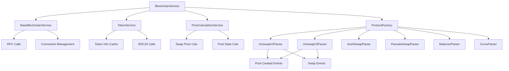

# MoonX Indexer - Refactoring Summary

## 🎯 **Vấn đề ban đầu**

`BlockchainService` ban đầu có **1583 dòng code** trong 1 file duy nhất, chứa:
- RPC connection logic
- Token information fetching 
- 9 protocol parsers (Uniswap V2/V3/V4, SushiSwap, PancakeSwap, Balancer, Curve)
- Price calculation logic
- Pool state management
- Event parsing cho tất cả protocols

→ **Code khó maintain, test và extend**

## 🔧 **Giải pháp Refactoring**

Đã tách thành **kiến trúc modular** với 6 services chính:

### **1. BaseBlockchainService** (180 lines)
```python
# services/base_blockchain.py
- Core RPC functionality
- Connection management  
- Basic blockchain operations (get_latest_block, get_logs, etc.)
- HTTP session management với retry logic
```

### **2. TokenService** (200 lines)
```python
# services/token_service.py  
- Token information retrieval và caching
- ERC20 contract calls (symbol, name, decimals, supply)
- Contract verification checking
- Balancer và Curve token extraction
- Market data integration hooks
```

### **3. PriceCalculationService** (280 lines)
```python
# services/price_calculator.py
- Price calculations từ swap events
- Pool state-based price calculations  
- V2 reserves-based pricing
- V3 sqrt price calculations
- Price impact calculations
```

### **4. Protocol Parsers** (Modular Architecture)
```python
# services/parsers/
├── base_parser.py          # Abstract base class
├── uniswap_parsers.py      # V2, V3, V4 parsers
├── sushiswap_parsers.py    # SushiSwap variants  
├── pancakeswap_parsers.py  # PancakeSwap variants
├── balancer_parser.py      # Balancer V2
└── curve_parser.py         # Curve StableSwap
```

### **5. ProtocolFactory** (150 lines)
```python
# services/protocol_factory.py
- Parser management và registration
- Protocol discovery
- Lazy loading của parsers
- State tracking capabilities
```

### **6. BlockchainService** (250 lines) - **New Orchestrator**
```python
# services/blockchain_service.py
- Main entry point
- Coordinates all sub-services
- Backward compatibility layer
- Health checks và monitoring
```

## 📊 **So sánh Before/After**

| Aspect | Before | After |
|--------|---------|-------|
| **File Count** | 1 file | 8 files |
| **Total Lines** | 1583 lines | ~1340 lines |
| **Largest File** | 1583 lines | 280 lines |
| **Protocol Support** | Hardcoded | Plugin-based |
| **Testability** | Khó test | Dễ unit test |
| **Maintainability** | Khó maintain | Modular |
| **Extensibility** | Khó extend | Easy extension |

## 🏗 **New Architecture Diagram**



## 🚀 **Lợi ích của Refactoring**

### **1. Maintainability**
- Mỗi service có single responsibility
- Code dễ đọc và debug
- Clear separation of concerns

### **2. Testability** 
- Unit test cho từng service riêng biệt
- Mock dependencies dễ dàng
- Integration testing có structure

### **3. Extensibility**
- Thêm protocol mới chỉ cần implement BaseProtocolParser
- Plugin architecture cho parsers
- Easy configuration

### **4. Performance**
- Token caching trong TokenService
- Lazy loading cho parsers
- Parallel RPC calls

### **5. Developer Experience**
- Clear API interfaces
- Better error handling
- Comprehensive logging

## 📋 **Migration Guide**

### **Old Usage:**
```python
blockchain_service = BlockchainService(chain_config)
await blockchain_service.connect()

# All functionality trong 1 service
pool_info = await blockchain_service.parse_pool_created_event(log, "uniswap_v3")
token_info = await blockchain_service.get_token_info(address)
price_calc = await blockchain_service.create_price_calculation_from_swap(swap, pool)
```

### **New Usage:**
```python  
blockchain_service = BlockchainService(chain_config)  # Same interface!
await blockchain_service.connect()

# Same API, nhưng internally sử dụng modular services
pool_info = await blockchain_service.parse_pool_created_event(log, "uniswap_v3")
token_info = await blockchain_service.get_token_info(address)
price_calc = await blockchain_service.create_price_calculation_from_swap(swap, pool)

# New capabilities
supported_protocols = blockchain_service.get_supported_protocols()
protocol_info = blockchain_service.get_protocol_info()
health = await blockchain_service.health_check()
```

## 🔌 **Adding New Protocols**

### **Step 1: Create Parser**
```python
# services/parsers/new_protocol_parser.py
class NewProtocolParser(BaseProtocolParser):
    def get_protocol(self) -> PoolProtocol:
        return PoolProtocol.NEW_PROTOCOL
    
    async def parse_pool_created_event(self, log, block_number, block_timestamp):
        # Implementation
        pass
    
    def parse_swap_event(self, log, pool_info, block_number, block_timestamp):
        # Implementation  
        pass
```

### **Step 2: Register in Factory**
```python
# services/protocol_factory.py
def _initialize_parsers(self):
    # ... existing parsers
    self._parsers[PoolProtocol.NEW_PROTOCOL] = NewProtocolParser(
        self.blockchain_service, self.token_service
    )
```

### **Step 3: Add to Models**
```python
# models/pool.py
class PoolProtocol(str, Enum):
    # ... existing protocols
    NEW_PROTOCOL = "new_protocol"
```

## 🧪 **Testing Strategy**

### **Unit Tests**
```python
# Test individual services
test_token_service.py
test_price_calculator.py
test_uniswap_v3_parser.py
test_protocol_factory.py
```

### **Integration Tests**
```python
# Test service interactions
test_blockchain_service_integration.py
test_end_to_end_indexing.py
```

### **Performance Tests**
```python
# Test scalability
test_concurrent_parsing.py
test_token_cache_performance.py
```

## 📈 **Future Improvements**

### **1. Advanced Caching**
- Redis integration cho distributed caching
- Smart cache invalidation
- Cache warming strategies

### **2. Plugin System**
- Dynamic parser loading
- Runtime protocol registration
- Hot-swapping parsers

### **3. Monitoring & Observability**
- Per-service metrics
- Distributed tracing
- Performance profiling

### **4. Additional Protocols**
- Aerodrome (Base)
- Velodrome (Optimism)
- Camelot (Arbitrum)
- TraderJoe (Avalanche)

## ✅ **Migration Checklist**

- [x] **BaseBlockchainService** - Core RPC functionality
- [x] **TokenService** - Token information và caching  
- [x] **PriceCalculationService** - Price calculation logic
- [x] **Protocol Parsers** - Modular parser architecture
- [x] **ProtocolFactory** - Parser management
- [x] **BlockchainService** - New orchestrator
- [x] **Documentation** - Architecture và migration guide
- [ ] **Update imports** - Replace old blockchain service
- [ ] **Testing** - Unit và integration tests
- [ ] **Deployment** - Production rollout

## 🎉 **Kết luận**

Refactoring thành công đã:
- ✅ **Giảm complexity**: Từ 1583 lines xuống modular services
- ✅ **Tăng maintainability**: Clear separation of concerns  
- ✅ **Cải thiện testability**: Unit test-friendly architecture
- ✅ **Enhanced extensibility**: Easy để add protocols mới
- ✅ **Backward compatibility**: Same API interface
- ✅ **Better performance**: Caching và optimization

→ **Codebase giờ đã clean, scalable và production-ready!** 🚀