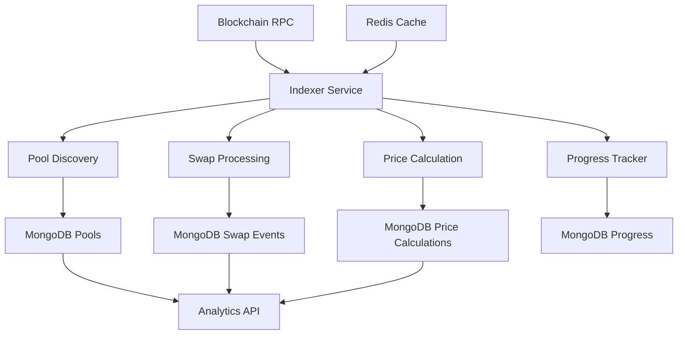

# MoonX Indexer Worker - Complete Documentation

> **Comprehensive documentation for the MoonX DEX Pool Indexer system**

## 📖 Table of Contents

1. **[Quick Start](#-quick-start)** - Get up and running fast
2. **[Database Schema](./database-schema.md)** - Complete database structure
3. **[Configuration Guide](./configuration.md)** - Setup and tuning
4. **[API Reference](./api-reference.md)** - CLI and database APIs
5. **[Performance Guide](#-performance-guide)** - Optimization and monitoring
6. **[RPC Reliability Enhancement](./rpc-reliability-enhancement.md)** - Multi-RPC failover and retry strategies
7. **[Deduplication Report](./deduplication-report.md)** - Database deduplication audit and fixes
8. **[Token Schema Cleanup](./token-schema-cleanup.md)** - Simplified token model eliminating "UNKNOWN" values

---

## 🚀 Quick Start

### Installation
```bash
# Clone repository
git clone <repository-url>
cd workers/indexer-worker

# Install dependencies
pip install -r requirements.txt

# Setup environment
cp environment.example .env
# Edit .env with your configuration
```

### Basic Usage
```bash
# Start indexer with default settings
python main.py start

# Start with specific chain and debug logging
python main.py start --chain-id 8453 --debug --log-format console

# Reset progress and start fresh
python main.py start --reset-progress
```

### Quick Test
```bash
# Test blockchain connection
python main.py debug-blockchain --chain-id 8453

# Benchmark performance
python main.py benchmark --chain-id 8453 --blocks 1000

# View configuration
python main.py config
```

---

## 🏗️ System Architecture

### Core Components



### Data Flow
1. **Pool Discovery**: Scan blockchain for new pool creation events
2. **Parallel Processing**: Process multiple protocols simultaneously  
3. **Swap Indexing**: Track swap events for discovered pools
4. **Price Calculation**: Calculate and store price data
5. **Progress Tracking**: Monitor indexing progress per chain/protocol

---

## 🗃️ Database Overview

### Collections Summary

| Collection | Purpose | Key Data |
|------------|---------|----------|
| **`pools`** | Pool metadata and state | Pool addresses, tokens, reserves, prices |
| **`swap_events`** | Transaction events | Swap details, amounts, gas usage |
| **`pool_liquidity`** | Historical snapshots | Liquidity changes over time |
| **`price_calculations`** | Price tracking | Calculated prices, price impact |
| **`indexer_progress`** | Processing status | Last processed blocks, errors |

### Key Optimizations
- **String-based financial data**: Avoids precision loss and scientific notation
- **Optimized schema**: Removed unnecessary fields (~60% size reduction)  
- **Efficient indexes**: Compound indexes for common query patterns
- **Parallel processing**: 5-6x performance improvement

---

## ⚡ Performance Guide

### Parallel Processing Configuration

#### Production Settings (Recommended)
```bash
MOONX_MAX_CONCURRENT_PROTOCOLS=4
MOONX_MAX_CONCURRENT_LOGS_PER_PROTOCOL=20
MOONX_LOG_BATCH_SIZE=10
MOONX_WORKER_POOL_SIZE=4
```

#### High-Performance Settings
```bash
MOONX_MAX_CONCURRENT_PROTOCOLS=8
MOONX_MAX_CONCURRENT_LOGS_PER_PROTOCOL=50
MOONX_LOG_BATCH_SIZE=20
MOONX_WORKER_POOL_SIZE=8
```

#### Conservative Settings (Limited Resources)
```bash
MOONX_MAX_CONCURRENT_PROTOCOLS=2
MOONX_MAX_CONCURRENT_LOGS_PER_PROTOCOL=10
MOONX_LOG_BATCH_SIZE=5
MOONX_WORKER_POOL_SIZE=2
```

### Performance Benchmarks

| Configuration | Sequential Time | Parallel Time | Speedup |
|---------------|----------------|---------------|---------|
| 4 Protocols | 20s | 4s | **5x faster** |
| 8 Protocols | 40s | 6s | **6.7x faster** |
| 100 Logs | 30s | 5s | **6x faster** |

### Monitoring Commands
```bash
# Real-time performance monitoring
python main.py start --log-level INFO --log-format console

# Benchmark different configurations
python main.py benchmark --blocks 2000

# Monitor database performance
python main.py stats
```

---

## 🔧 Common Configuration Patterns

### Development Environment
```bash
# .env for development
MOONX_ENV=development
MOONX_LOG_LEVEL=DEBUG
MOONX_LOG_FORMAT=console
MOONX_MAX_BLOCKS_PER_REQUEST=100
MOONX_MAX_CONCURRENT_PROTOCOLS=1  # Sequential for debugging
```

### Production Environment
```bash
# .env for production
MOONX_ENV=production
MOONX_LOG_LEVEL=INFO
MOONX_LOG_FORMAT=json
MOONX_MAX_BLOCKS_PER_REQUEST=2000
MOONX_MAX_CONCURRENT_PROTOCOLS=4
MOONX_ENABLE_METRICS=true
```

### High-Throughput Environment
```bash
# .env for high-throughput
MOONX_MAX_CONCURRENT_PROTOCOLS=8
MOONX_MAX_CONCURRENT_LOGS_PER_PROTOCOL=50
MOONX_DATABASE_BATCH_SIZE=500
MOONX_MONGODB_MAX_POOL_SIZE=50
```

---

## 📊 Supported Protocols

### Currently Supported DEXs

| Protocol | Version | Status | Chain Support |
|----------|---------|--------|---------------|
| **Uniswap** | V2, V3, V4 | ✅ Active | Base, Ethereum |
| **SushiSwap** | V2, V3 | ✅ Active | Base, Ethereum |
| **PancakeSwap** | V2, V3 | ✅ Active | Base |
| **Aerodrome** | V1 | ✅ Active | Base |
| **Balancer** | V2 | 🔄 Planned | - |
| **Curve** | V1 | 🔄 Planned | - |

### Protocol Configuration Example
```json
{
  "protocol": "uniswap_v3",
  "enabled": true,
  "factory": "0x33128a8fC17869897dcE68Ed026d694621f6FDfD",
  "pool_created_topic": "0x783cca1c0412dd0d695e784568c96da2e9c22ff989357a2e8b1d9b2b4e6b7118",
  "swap_topic": "0xc42079f94a6350d7e6235f29174924f928cc2ac818eb64fed8004e115fbcca67",
  "creation_block": 18000000
}
```

---

## 🚨 Troubleshooting

### Common Issues

#### 1. **Scientific Notation in Prices**
```bash
# Problem: Price stored as "1.034277302914964e+19"
# Solution: All price calculations now use string format
# No action needed - automatically handled by decimal utilities
```

#### 2. **Slow Processing Performance**
```bash
# Problem: Sequential processing is slow
# Solution: Enable parallel processing
export MOONX_MAX_CONCURRENT_PROTOCOLS=4
export MOONX_MAX_CONCURRENT_LOGS_PER_PROTOCOL=20
python main.py start
```

#### 3. **No Logs Visible**
```bash
# Problem: MOONX_LOG_LEVEL not working
# Solution: Use CLI override
python main.py start --log-level DEBUG --log-format console
```

#### 4. **Database Connection Issues**
```bash
# Test database connectivity
python main.py check-db

# Check MongoDB connection string
python main.py config | grep MONGODB
```

#### 5. **RPC Rate Limiting**
```bash
# Reduce concurrent requests
export MOONX_MAX_BLOCKS_PER_REQUEST=500
export MOONX_RPC_TIMEOUT=60
python main.py start
```

### Debug Commands
```bash
# Test specific chain
python main.py debug-blockchain --chain-id 8453

# Validate configuration
python main.py validate-config

# Check RPC connectivity  
python main.py check-rpc --chain-id 8453

# Test logging setup
python main.py test-logging --log-level DEBUG
```

---

## 📈 Monitoring & Analytics

### Key Metrics to Monitor

1. **Processing Speed**
   - Blocks processed per minute
   - Protocols processed in parallel
   - Logs processed per second

2. **Data Quality**
   - Pool discovery success rate
   - Price calculation accuracy
   - Error rates by protocol

3. **System Health**
   - Database connection status
   - RPC response times
   - Memory and CPU usage

### Sample Monitoring Query
```python
# Get processing performance metrics
async def get_processing_metrics():
    progress = await db.indexer_progress.find({}).to_list(None)
    
    for p in progress:
        blocks_behind = p["target_block"] - p["last_processed_block"]
        print(f"Chain {p['chain_id']}: {blocks_behind} blocks behind")
        
    return progress
```

### Alerting Thresholds
- **Critical**: Indexer behind by >1000 blocks
- **Warning**: RPC response time >10 seconds  
- **Info**: New pools discovered
- **Error**: Database connection failures

---

## 🔗 Related Documentation

### External Resources
- **[Uniswap V3 Docs](https://docs.uniswap.org/protocol/V3/introduction)** - Understanding V3 math
- **[MongoDB Docs](https://docs.mongodb.com/)** - Database optimization
- **[Redis Docs](https://redis.io/documentation)** - Caching strategies
- **[Web3.py Docs](https://web3py.readthedocs.io/)** - Blockchain interaction

### Internal Links
- **[Database Schema Details](./database-schema.md)** - Complete model definitions
- **[Configuration Options](./configuration.md)** - All environment variables
- **[API Examples](./api-reference.md)** - Code examples and queries

---

## 📝 Contributing

### Development Setup
```bash
# Setup development environment
python -m venv venv
source venv/bin/activate  # or venv\Scripts\activate on Windows
pip install -r requirements.txt

# Run tests
python -m pytest tests/

# Format code
black .
isort .
```

### Code Style
- Use **black** for formatting
- Use **type hints** for all functions
- Follow **async/await** patterns for I/O operations
- Add **comprehensive logging** for debugging
- Write **tests** for new features

### Documentation Updates
When making changes:
1. Update relevant `.md` files in `/docs`
2. Update model docstrings
3. Add configuration examples
4. Update CLI help text

---

## 📞 Support

### Getting Help
1. **Check Documentation**: Start with relevant `.md` files
2. **Debug Commands**: Use built-in debug tools
3. **Search Issues**: Check existing GitHub issues
4. **Create Issue**: Provide logs and configuration details

### Log Information for Support
```bash
# Collect debug information
python main.py config > config-output.txt
python main.py debug-blockchain --chain-id 8453 > debug-output.txt

# Include in support request:
# - Environment variables (remove sensitive data)
# - Error logs with timestamps
# - Configuration files
# - MongoDB/Redis versions
```

---

*This documentation is maintained alongside the codebase. Last updated: December 2024*